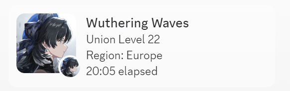

# Wuthering Waves Discord Rich Presence

Enables Discord Rich Presence for Wuthering Waves

    
    

## Table of Contents

<ol>
    <li><a href="#usage">Usage</a></li>
    <li><a href="#building-from-source">Building from source</a></li>
    <li><a href="#warning">Warning</a></li>
</ol>

## Usage

1. Download the [latest release](
    https://github.com/xAkre/Wuthering-Waves-RPC/releases/tag/Latest
) 
2. Run the executable

## Building from source

1. Clone the repository
2. Run `pip install -r requirements.txt`
3. Run `pyinstaller wuthering_waves_rpc.spec`
4. The executable will be located in `dist/`

## Warning

This is a third-party application and is not affiliated with Wuthering Waves or its developers. Because 
this app gets it's data from a local database located in the Wuthering Waves Game directory, it is possible that it could be flagged in some way by the game's anticheat. When testing, I did not encounter any issues, but I cannot guarantee that you will not be banned for using this application. Use at your own risk

